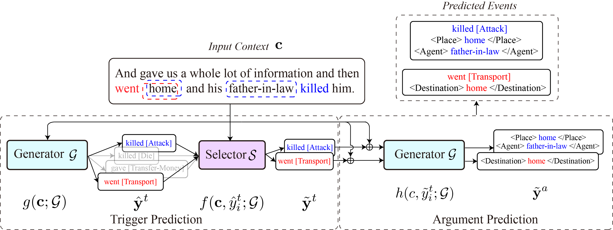

# <div align="center">COFFEE: A Contrastive Oracle-Free Framework for Event Extraction<div>

<div align="center">
<a href="https://arxiv.org/abs/2303.14452" target="_blank"></a>
<a></a>
</div>

<p align="center">

</p>


### Setup

  - Python=3.7.10
  ```
  $ conda env create -f environment.yml
  ```

### Data Preprocessing
- Go into the folder `./preprocessing/`
- Collect all these data under `Dataset` with the follow steps:
1. Download ERE English data from LDC, using 2023 version from [LDC](https://catalog.ldc.upenn.edu/LDC2023T04), you will get a folder called `DEFT_English_Light_and_Rich_ERE_Annotation`
2. Download ACE 2005 Data from [LDC](https://catalog.ldc.upenn.edu/LDC2006T06), you will get a folder called `ace_2005_td_v7`, put it under `Dataset`
3. Download processed-data from [Xu et al.](https://github.com/fe1ixxu/Gradual-Finetune/tree/master/dygiepp/data/ace-event/processed-data). Put their `processed-data` under `Dataset`
4. The dataset structure is as follows

```
Dataset
├── ace_2005_td_v7
│   └── data
│       ├── Arabic
│       ├── Chinese
│       └── English
│           ├── bc
│           ├── bn
│           └── ...
├── ace_2005_Xuetal
│   └── en
│       └── json
│           └── ...
└── DEFT_English_Light_and_Rich_ERE_Annotation
    ├── data
    ├── docs
    └── ...

```

**Preprocess data**
- Run `sh process_ace.sh` to get ACE05-E variant of ACE2005 Event data, which is the same as [dygiepp](https://arxiv.org/pdf/1909.03546.pdf)
- Run `sh process_acep.sh` to get ACE05-E+ event data, in the format as [oneie](https://aclanthology.org/2020.acl-main.713.pdf)
- Run `sh process_ere.sh` to get ERE-En event data, in the format as [oneie](https://aclanthology.org/2020.acl-main.713.pdf)

If you follow the instruction in the README.md, then you can get your data in the folder `./processed_data/`


### Training of Generator

- Run `./scripts/generate_data.sh` to generate training examples. The generated training data will be saved in `./finetuned_data/`.

- Run `./scripts/train_ace05.sh` to train the Generator on ACE05-E.
- Run `./scripts/train_ace05p.sh` to train the Generator on ACE05-E+.
- Run `./scripts/train_ere.sh` to train the Generator on ERE.

- Alternatively, you can run the following command with specific json file
  ```
  python ./src/train_generator.py -c ./config/config_ace05_T5-base_en.json
  ```
  
This trains generator with t5-base model for the selected dataset which is ACE05. The model will be saved in `./output/`.
You can modify the arguments in the config file or replace the config file with other files in `./config/`.
 

### Inference the Generator and generate trigger candidates

- Run `./scripts/eval_gen.sh`. This will generate trigger candidates and save to the setted OUTPUT_DIR (e.g. `./trigger_candidates/ere/')

### Training of Selector
- Run `./scripts/train_selector.sh`. This will train the post-generation ranking model to re-rank the trigger candidates
- The trained selector will be saved under folder `./cache_eval/`

### Inference the Selector and find optimal threshold and weight on development set


### Generate arguments based on the selected trigger prediction and evaluate with F1-score on test set
- Run `./scripts/post_ranker.sh`. Generate the final predictions and evaluate using the F1-scores.

## To cite
```
@misc{zhang2023coffee,
      title={COFFEE: A Contrastive Oracle-Free Framework for Event Extraction}, 
      author={Meiru Zhang and Yixuan Su and Zaiqiao Meng and Zihao Fu and Nigel Collier},
      year={2023},
      eprint={2303.14452},
      archivePrefix={arXiv},
      primaryClass={cs.CL}
}
```

## Acknowledgments

This code is based on the work done by [Kuan-Hao Huang et. al ](https://github.com/PlusLabNLP/X-Gear)


